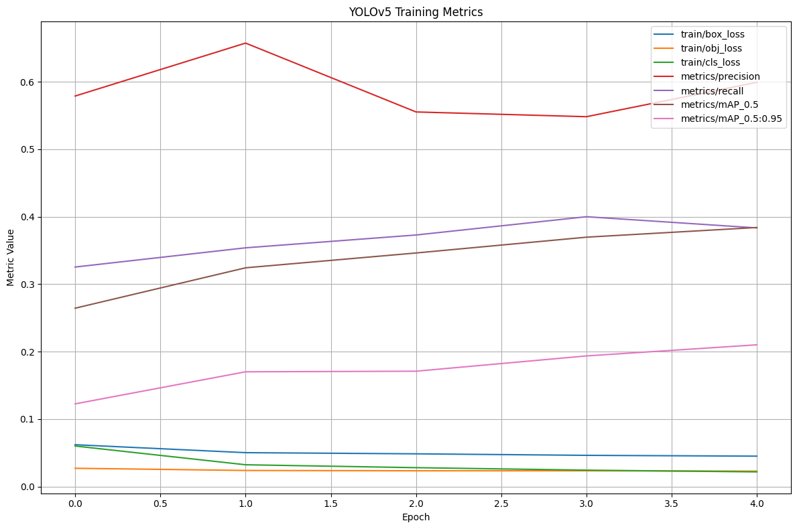

# Light Weight object Detection Model

This project is a collaborative effort between [@Lakshman200](https://github.com/Lakshman200) and [@friend_username](https://github.com/friend_username), aimed at developing and visualizing the training performance of a lightweight object detection model using YOLOv5.

## 🎯 Objective

To build and evaluate a lightweight, fast YOLOv5-based object detection model optimized for resource-constrained environments such as mobile and embedded systems.

## 📁 Files Included

- `light-weight-detection.ipynb`: Jupyter Notebook that loads YOLOv5 training logs and visualizes key metrics.
- `results.png`: A saved plot showing training performance across epochs.
- `results.csv`: (Optional) CSV log file containing training metrics exported by YOLOv5.
- `.gitignore`: Ensures unnecessary temp and cache files are not committed.

## 📊 Metrics Visualized

- Box Loss (`train/box_loss`)
- Objectness Loss (`train/obj_loss`)
- Classification Loss (`train/cls_loss`)
- Precision
- Recall
- mAP@0.5
- mAP@0.5:0.95

## 📈 Output



This graph shows how each metric evolves over the course of training, helping evaluate convergence and generalization performance.

## 🔧 Requirements

- Python 3.x
- pandas
- matplotlib

## 🚀 How to Run

1. Clone the repository:
   ```bash
   git clone https://github.com/Lakshman200/light-weight-detection-model.git
   cd light-weight-detection-model
